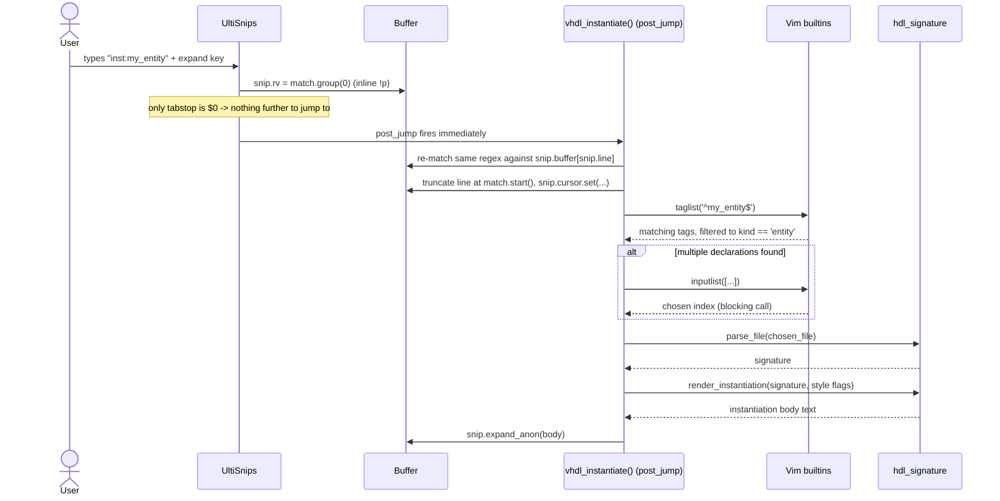

# Build Walkthrough: the `inst:entity_name` Instantiation Snippet

This document explains how the VHDL `inst:entity_name` instantiation feature
was built, not how to use it. The trigger syntax and its style letters are
already described as inline comments in `ftype-settings.vim` and summarized in
`CLAUDE.md`; this walkthrough exists so that the techniques underneath it —
UltiSnips dynamic snippets, ctags/Vim integration, and Python-in-Vim plumbing
— can be reused for similar features, and so that the non-obvious failure
modes encountered while building it are recorded rather than rediscovered.

The feature lives in three files: `UltiSnips/vhdl.snippets` (the trigger
snippet and the `vhdl_instantiate()` callback), `ftype-settings.vim` (the
vimrc-configurable default), and `plugconf/telescope.lua` (the `,tm` picker
that inserts the trigger text).

## Trigger syntax, briefly

The trigger is `inst:entity_name`, optionally followed by `:` and a subset of
the letters `p`, `t`, `a` — prefill, tabstop, and align, in whichever
combination the caller wants. `inst:foo` alone falls back to a vimrc-wide
default (see below). `inst:foo:pa` and `inst:foo:` are both explicit and
therefore override that default completely: the former turns on prefill and
align, and the latter — an explicit but empty suffix — turns everything off.
That distinction, between "no suffix at all" and "suffix present but empty",
is what makes the two cases behave differently, and it recurs later in this
document as the difference between `None` and `""` in the parsed regex
groups.

## The post_jump round-trip trick

UltiSnips lets a snippet's body reference the regex `match` object that
triggered it, but only inline, through the `!p snip.rv = match.group(...)`
interpolation syntax. A `post_jump` callback — a Python function that fires
when the cursor leaves a tabstop — receives only `snip`, the snippet's own
state object; `match` is out of scope by the time `post_jump` runs. Building
`vhdl_instantiate()`, which needs the full matched text (entity name plus
style suffix) inside a `post_jump` callback rather than an inline `!p`, means
that information has to survive the gap between the two some other way.

The pre-existing `vhdl_fsm()` function in the same file, a comma-separated
state-list-to-FSM-skeleton expander, had already solved this. Its trigger
snippet is a single line:

```
snippet "fsm\s+(((\w+),)*\w+)" "Finite state machine" br
`!p snip.rv = match.group(1) `$0
endsnippet
```

The inline `!p` writes the matched state list back into the buffer as literal
text via `snip.rv`, and the attached `post_jump "vhdl_fsm(snip)"` callback
then re-runs a hand-written pattern against `snip.buffer[snip.line]` to
recover that same text — trading the `match` object it no longer has access
to for a second regex pass over a buffer it does have access to.
`vhdl_instantiate()` reuses this exactly, re-running the trigger's own regex,
`inst:(\w+)(?::([pta]*))?`, against `snip.buffer[snip.line]`. The one
difference is that `vhdl_fsm` clears the whole line — its captured text (the
state list) *is* the whole line — whereas `vhdl_instantiate` slices only from
`m.start()` onward, since it needs to preserve whatever indentation already
sits on the line, such as inside an `architecture` body.

The `post_jump` callback fires with no user action beyond the initial
expansion because the trigger snippet's only tabstop is `$0`. UltiSnips
treats expansion itself as leaving tabstop 0 — jumping into it and then
immediately past it, since there is nowhere else to go — so `post_jump` runs
synchronously as part of expansion rather than waiting for a subsequent
keypress. Both snippets rely on this: the raw match text never needs to be
visible to the user, because it is captured and overwritten in the same
motion as expansion.



The following four sections describe the stages in that diagram in more
detail.

## Entity resolution via `taglist()`

Once `vhdl_instantiate()` has the entity name back from the buffer, it needs
to find the declaration. The implementation calls Vim's built-in
`taglist('^entity_name$')` rather than opening and parsing a tags file by
hand. `taglist()` already understands the tags-file format, respects whatever
tag files are active for the current buffer (however they got there — a
project-root `tags`, a gutentags-managed cache file, several stacked tag
files), and returns structured dictionaries instead of raw lines, which
removes an entire category of parsing bugs that a hand-rolled reader would
have to get right itself.

Two details about `taglist()`'s output mattered enough to verify directly
rather than assume from the ctags documentation. First, this repository
generates tags with `--fields=+K`, and under that flag a tag's kind comes
back from `taglist()` as the long-form string `'entity'`, not the short
letter `'e'` that ctags uses in some other contexts — confirmed by generating
a real tags file for a VHDL project and inspecting `taglist()`'s return value
directly, rather than trusting either the ctags man page or an assumption
carried over from short-form kind letters used elsewhere. Any reader can
reproduce this check against their own project once a tags file with
`--fields=+K` exists, with `:echo taglist('^some_entity_name$')`. Second,
`taglist()`'s `filename` field is already resolved relative to the tags
file's own directory — Vim's default `'tagrelative'` behavior — regardless of
the current working directory of the process making the call. This mattered
concretely here because gutentags stores its tags file under `~/.cache`, not
under the project root; a filename assumed to be relative to the project
directory, or to `getcwd()`, would have resolved to the wrong path and failed
silently or pointed at a nonexistent file. `vhdl_instantiate()` still runs the
result through `fnamemodify(..., ':p')` before handing it to
`hdl_signature.parse_file()`, which normalizes it to a fully qualified
absolute path regardless of which directory it started out relative to.

## Disambiguation: `inputlist()`, not a Telescope picker

A tags database can hold more than one declaration for the same entity name
— across different files, or after a rename that left a stale copy. When
`taglist()` returns declarations from more than one file, the user has to
choose which one to instantiate against. The natural instinct in a codebase
that already uses Telescope extensively (see `plugconf/telescope.lua`) is to
reach for a Telescope picker for this too. That does not fit here.

Telescope pickers are asynchronous: `pickers.new(...):find()` returns
immediately, and the user's eventual selection arrives later, inside an
`attach_mappings` callback, on Neovim's event loop. The code in
`vhdl_instantiate()`, however, is a synchronous Python function running
inside UltiSnips' `post_jump` machinery, and it needs the chosen file's path
*before it can continue* — it still has to call `parse_file()` and
`expand_anon()` afterward, in the same function invocation, to finish
building the snippet body. There is no callback to resume into later; the
call either returns a usable value now, or the snippet body cannot be
produced.

`inputlist()` is a blocking Vim builtin: it displays a numbered prompt,
suspends execution until the user types a number and presses Enter, and
returns that choice as an ordinary return value. That is the shape a
synchronous caller needs, so `vhdl_instantiate()` builds a numbered list of
candidate file paths and calls `inputlist()` directly, rather than
introducing an asynchronous picker into a call site that cannot suspend and
resume around one.

## The `snip.cursor` bug

This was the least obvious failure encountered while building the feature,
and the one worth describing in the most detail.

UltiSnips requires that any `pre_expand`, `post_expand`, or `post_jump`
action which modifies the line the cursor sits on must also call
`snip.cursor.set(line, column)` explicitly, using 0-indexed coordinates, to
tell UltiSnips where the cursor should end up. Skipping that call, after the
line has in fact changed, raises `PebkacError: "line under the cursor was
modified, but snip.cursor variable is not set"`.

`vhdl_instantiate()`'s first version omitted this call and worked correctly
on the successful path — full instantiation rendered, `expand_anon()`
called, no error. It failed immediately, with exactly that `PebkacError`, the
first time the "entity not found" branch was exercised: the branch that
truncates the buffer line down to `m.start()` and then returns early, without
ever reaching `expand_anon()`. Two code paths, one editing the same line in
the same way, one working and one raising an error that read as unrelated to
anything the code visibly did wrong.

The cause was not obvious from the error text or from UltiSnips' user-facing
documentation, and was found instead by reading UltiSnips' own Python source:
`_execute_action` in `snippet/definition/base.py`, and the `_SnippetUtilCursor`
class in `text_objects/python_code.py`. Between them, those two pieces of
source explain both halves of the behavior. `_execute_action` wraps every
`pre_expand`/`post_expand`/`post_jump` call, and afterward compares the
line's content against what it was before the action ran; if the line
changed, it checks whether `snip.cursor` was explicitly set during the
action, and raises the `PebkacError` if not, on the reasoning that once a
Python callback has rewritten a line arbitrarily, UltiSnips has no principled
way to infer where the cursor should now sit relative to the new text —
that mapping only exists if the callback states it directly.
`_SnippetUtilCursor` is the class backing `snip.cursor`, and it tracks
whether `.set()` was called via an internal flag exposed through
`is_set()`. Critically, `expand_anon()` — the same call the success path
happens to make right after truncating the line — internally calls
`self.cursor.preserve()` as part of its own bookkeeping, and `preserve()`
counts as setting the cursor for the purposes of that later check. The
success path was never actually cursor-safe by design; it was accidentally
safe because the truncation happened to leave the cursor sitting exactly at
`m.start()`, the same column `expand_anon()` would preserve into, and because
`expand_anon()` always ran afterward and quietly satisfied the requirement as
a side effect. The early-return paths never call `expand_anon()`, so nothing
downstream ever set the cursor, and the previously invisible gap surfaced as
an immediate error.

The fix is the explicit call already visible in the current code,
immediately after the line is truncated:

```python
snip.buffer[snip.line] = line[: m.start()]
snip.cursor.set(snip.line, m.start())
```

placed before any branch that might return early, so that every exit path —
not just the one that reaches `expand_anon()` — leaves the cursor in a state
UltiSnips considers valid. The general lesson is narrower than "always call
`snip.cursor.set()`": it is that a success path exercising a side-effecting
API (`expand_anon()`, here) can mask a missing invariant that a failure path,
which skips that API, will expose. Code that edits the buffer inside a
`post_jump`/`pre_expand`/`post_expand` callback needs that invariant checked
on every exit path independently, not inferred from the fact that one path
happened to work.

## The vimrc-configurable default

`g:vhdl_instantiation_default_style` supplies the style letters used when a
trigger omits the `:options` suffix entirely. It is defined in
`ftype-settings.vim` as:

```vim
let g:vhdl_instantiation_default_style = get(g:, 'vhdl_instantiation_default_style', 'pa')
```

`get(g:, name, default)` reads a global variable if it already exists, and
falls back to the given default if it does not, without raising an error
either way — unlike a plain `g:name` reference, which errors on an unset
variable. Assigning the variable to `get()` of itself is the standard idiom
for a plugin-style default that a user's own `init.vim` should be able to
override regardless of load order: if the user's `init.vim` sets
`g:vhdl_instantiation_default_style` before `ftype-settings.vim` is sourced,
`get()` picks up that value and the assignment becomes a no-op; if the user
never set it, `get()` falls through to `'pa'` and the variable is defined for
the first time. Either way, `ftype-settings.vim` never has to know, and the
user never has to source their override in a particular order relative to
this repository's own files.

`vhdl_instantiate()` performs the same lookup a second time, directly from
Python, at the moment a trigger without an explicit suffix is expanded:

```python
opts = vim.eval("get(g:, 'vhdl_instantiation_default_style', 'pa')")
```

This second lookup is not strictly required, since `ftype-settings.vim` will
already have run and defined the variable by the time any VHDL snippet can
expand — but it costs nothing to repeat, and it means `vhdl_instantiate()`
does not depend on `ftype-settings.vim` having run first as an unstated
precondition, which matters if either file is ever refactored independently
of the other.

## The `,tm` picker's insert-not-jump technique

`,tm`, defined in `plugconf/telescope.lua` as `insert_instantiation_trigger()`,
lists every entity name found in the project's tags files and, on selection,
writes `inst:entity_name` at the cursor. This is a deliberate departure from
how every other Telescope picker in this configuration behaves: `,tt`
(`Telescope tags`) and `,tk` (the kind-filtered tag browser defined just
above it in the same file) both jump the cursor to the selected tag's
declaration. `,tm` does the opposite — it never leaves the buffer the user
was editing.

The mechanism is `attach_mappings` overriding `actions.select_default` to
call `vim.api.nvim_put({ "inst:" .. selection[1] }, "c", true, true)` followed
by `vim.cmd("startinsert!")`, rather than letting Telescope's stock jump
behavior run. `nvim_put()` inserts the given lines at the cursor using
characterwise placement (the `"c"` argument) without touching the jumplist
or switching buffers, and `startinsert!` leaves the user in insert mode,
cursor positioned after the inserted text, ready to press whatever key
triggers UltiSnips expansion. The picker's job ends at producing the bare
trigger text; entity resolution and disambiguation both happen later, inside
`vhdl_instantiate()` itself, once the snippet actually expands — the picker
does not try to resolve or disambiguate anything on its own.

One more detail distinguishes `,tm` from the Python-side lookup in
`vhdl_instantiate()`: `,tm` reads tag files directly with `vim.fn.readfile()`
and matches `kind:` fields against the raw lines, rather than calling
`taglist()`. This is because `taglist()` is a lookup-by-name API — it takes a
tag name pattern and returns matching entries — not an enumerate-everything
API. Populating a fuzzy-search list of every entity name in the project
requires walking the tag files' own text, since there is no name to look up
yet; `vhdl_instantiate()`, by contrast, already has a specific entity name
once the trigger has been typed, which is exactly the case `taglist()` is
built for.

## The Neovim `python3` provider wrinkle

UltiSnips' `!p` blocks and Python `post_jump` callbacks run under whichever
Python interpreter Neovim itself resolves as its `python3` provider — visible
from any Neovim instance via `:checkhealth provider` — and that interpreter
is not necessarily the system `python3`, nor necessarily whatever virtual
environment happens to be active in a shell the user is working from. In
this repository, that provider turned out to be a pipx-managed virtual
environment originally created only to hold `pynvim`, the package that lets
Neovim talk to a Python host process at all, located under
`~/.local/share/pipx/venvs/pynvim`.

`vhdl_instantiate()` imports `hdl_signature`, a separate package
(`parse_file`, `render_instantiation`) that is not part of Neovim's own
dependencies. Installing it with a plain `pip install` — into the system
interpreter, or into whatever environment a terminal's shell prompt
currently shows — would not make it importable from inside Neovim, because
that installation target and Neovim's `python3` provider are, in general,
different interpreters entirely. The dependency has to be injected into the
specific pipx-managed venv that provider resolves to:

```bash
pipx inject pynvim "hdl-signature @ git+https://github.com/mpkopec/hdl-signature.git"
```

`pipx inject` adds a package into an existing pipx-managed environment
without creating a new one, which is the operation needed here: `pynvim`'s
own pipx environment already is Neovim's `python3` provider, so injecting
into it, rather than installing elsewhere, is what makes `hdl_signature`
importable from a `!p` block or a `post_jump` callback. This dependency is
recorded in this repository's own `CLAUDE.md`, since it is a real
installation prerequisite for the feature, not an implementation detail
confined to how the feature was built.

## Summary

Three techniques generalize past this specific feature. First, when a
callback lacks access to information a sibling context had (here, `match` in
`post_jump`), round-tripping that information through the buffer itself, then
re-deriving it with the same logic that produced it originally, is a workable
substitute for passing it directly — provided the intermediate buffer state
is never user-visible, which a snippet with only a `$0` tabstop guarantees by
firing its callback immediately on expansion. Second, a synchronous call site
needs a synchronous API; an asynchronous, callback-driven picker cannot be
retrofitted into a function that must return a usable value before it can
continue, no matter how idiomatic that picker is elsewhere in the same
configuration. Third, when a library's error message names a symptom rather
than a cause — as `PebkacError`'s did here — the library's own source is
often faster to consult than guessing from the text of the error or from
its public documentation, particularly for an invariant, like a cursor-state
side effect of an unrelated call, that only manifests when one code path is
taken and not another.
